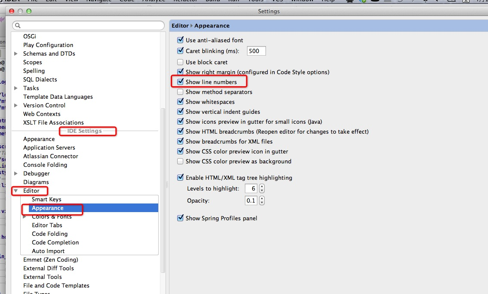
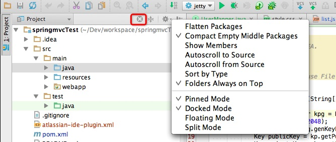

#从Eclipse转移到IntelliJ IDEA一点心得
个人使用IntelliJ其实并不太久，但是用了这段时间觉得的确很是好用，刚刚从Eclipse转过来的很多人开始可能很不适应，我这里就把我使用过程中的一些经验和一些常用的快捷键说下，当然在看这篇之前你需要先看完[IntelliJ IDEA 的 20 个代码自动完成的特性](http://www.oschina.net/question/12_70799),这篇翻译过来的文章对自动完成部分介绍的很好了,只是快捷键说明部分还可以更完善一些,可以照顾下默认绑定键位不一致的同鞋。本文在说明快捷键的时候会根据Mac OSX 10.5+的默认keymap来使用，当然也会提供相关的文字说明，如果和我的绑定不一致的可以直接去keymap中去搜索即可。

## 基本设置
### 显示行号
这个以前在Eclipse中是个很简单的问题,转移到IntelliJ上以后的一些人也问过这个问题,使用同样的方式设置了以后发现只是对当前文件起作用了,打开另外一个文件依然没有行号,就好比你只是在vim中执行命令`set number`,而不是在.vimrc中设置一样的效果.这个是需要在IDE Settings中设置下的,如图所示勾选即可:
 
其他设置可参照该设置项勾选即可,例如显示空格等等.

### 文件和导航关联
我们在写代码的时候经常需要打开某个文件的时候,想在左边的文件目录上自动打开当前所在的目录,这样很方便的找寻本目录下的其他文件或者其他的相关文件,其实这个IntelliJ提供了好几种解决方案,第一个就是和Eclipse一样的方式,如下:

* 以前在Eclipse中设置也很简单,但是IntelliJ里面稍微有点不一样,如果想临时一次的话,打开文件的时候点击下图的小地球图标即可

如果你想和Eclipse的那个一样,让这一切自动的话,那么在上图的浮层中可以看到两个选项`AutoScroll to Source`和`AutoScroll from source`,IntelliJ很人性化的分了两个设置在里面,你两个都勾选就是基本和Eclipse的功能保持了完全一致,只是勾选一个自然也可以.

还有一种方式就是利用IntelliJ提供的**Navigation Bar**,这个功能可以算是IntelliJ完全可以键盘化的一个特点之一吧,操作方式就是打开文件的时候,使用快捷键`⌘+UP (Jump to Navigation Bar)`,然后就会出现一个下拉,基本就是这个文件所在目录的文件列表,还可以使用**上下左右的键位**来选择其他目录,是不是很酷?操作好似比vim还更舒服?

**备注:**此处建议把`View > Navigation Bar`的选项点掉,这样就使用快捷键之后就会在你鼠标的位置出现,感觉会更输入一些,当然这样你就基本失去了使用鼠标的权利,这个需要你根据个人癖好使用即可.

## 快捷键使用
如果你是苹果电脑用户的话,建议你改成Mac OSX 10.5+的键位绑定,因为Mac OSX 10.5这个兼容Windows的版本的键位实在是太蹩脚了,用着是真难受,好比你默认习惯`⌘+w`是关闭标签,在这里竟然是选择文本的一个快捷键,当然这个键位是很有意义的.

这里主要介绍几个可能大家常用的,或者是你可能并不知道IntelliJ中有这样的几个快捷键,特别常用的你直接参照官网的Keymap介绍[Getting Started](http://www.jetbrains.com/idea/documentation/index.jsp)就可以了,学会在Keymap中自己查询需要的快捷键是主要的,不要每次都打开那个没用的百度,具体绑定可以参照本文最后给出的链接.
### outline调出
以前在Eclipse中用的很多的一个快捷键就是ctrl+o,这样可以调出Java文件的所有成员变量和方法,并且可以支持搜索很是方便,IntelliJ这种基本的功能自然是有,新手的话还经常问,这个在IntellJ中的快捷键是`⌘+F12 (File Structure)`,如果你不是Mac OSX 10.5+键位绑定的话,小括号中的内容就是你可以去Keymap中去搜索的内容.

###基本操作

* **复制整行或者块:**在Eclipse中使用`ctrl+alt+Up`,IntelliJ默认是`⌘+D (Duplicate Line or Block)`,其实这个和Eclipse中的有差距,尤其是多行的时候或者选中内容的时候,不信你可以试试,所以你可以把Keymap中的`Duplicate Lines`定义上一个快捷键,我定义的是`Shift+D`,这个键位在我的默认绑定中是没任何快捷键的,你可以自己绑定一个试试.
* **根据符号选择文本:**这个键位用的太多了,并且也是非常的好用,举个例子,有这样一行代码`<name>SpringSource Milestones Proxy</name>` 你光标在Milestones中的某一个位置,你想替换`SpringSource Milestones Proxy`为其他单词,假设想替换为`Test XX`,其实这样你只需要`Option+Up (Select Word at Caret)`两下就可以选中你想要的单词了,当你想在开发过程中,你会发现这个键位用的太多了,多到换了其他没有这个键位的编辑器或者IDE上,很是不习惯.
* **删除整行:** 可以直接`⌘+delete (Delete Line)`或者利用IntelliJ智能的功能,剪切的快捷键,当本行选中文本的时候剪切``⌘+x`会按照选中的文本实现剪切,但是你本行内无任何选中文本的时候会自动剪切整行,那么自然就类似一个删除本行的快捷键,但是这个其实还是比较蹩脚的,建议使用`⌘+delete`.
* **想直接跳转到接口的实现方法:** `⌘+option+鼠标单击`或者`⌘+option+B`.
* **语句自动完成 Statements completion:**这个在[IntelliJ IDEA 的 20 个代码自动完成的特性](http://www.oschina.net/question/12_70799)中已经说明,这里还是着重说下,因为的确很好用,也强烈推荐下,还有文中说的`智能自动完成 ⌘+shift+Space`,当给你的提示太多的时候,这个键绝对会给你惊喜.
* **同样单词之间跳转:**在Eclipse中的快捷键是`ctrl+k`,这个挺好用的,在IntelliJ中也不缺这个功能,但是在Mac OSX 10.5+的键位绑定中默认为空,据说Windows的默认绑定中是有绑定的,可以查询下,我自己绑定了一个`⌘+ctrl+k (Find Word at Caret)`,没有的需要自己绑定一个,然后还能结合其他的键位实现上一个`⌘+G (Find Next)`下一个`⌘+Shift+G (Find Previous)`的功能.很是实用.

##版本控制设置
我们开发肯定是有版本控制的，大家以前Eclipse的时候在本地文件和版本库不一致的时候，那么文件以及所在的文件夹都会出现一个`〉`表示，大家能很轻松的看到本地文件修改了哪一些，但是IntelliJ中默认是不能这样的，只是给文件在修改的时候提供了颜色上的变化，如果想和Eclipse一样的话需要如下图把设置勾选就可以了   

其实看英文解释就可以明白了，这个默认开启以后如果想调整文件夹的显示颜色的时候就直接去`Settings > Editor > Colors & Fonts > File Status`中调整即可了，可以调整成自己喜欢的样子。

##Java资源文件非英文的情况显示
IntelliJ在资源文件这方面个人觉得也是完胜Eclipse的，在Resource Bundle方式下想修改一个属性是相当方便的，可以在一个操作界面上修改所有语言的属性，这一切都是自动完成的，如下图所示：

并且还很贴心的有一个排序和分组的功能，尤其是这个排序。但是在默认设置下中文的是默认显示为Unicode码的，其实勾选一个设置(`Settings > File Encodings`)就可以了，如下图：    

这样设置以后所有Unicode显示的自动转化为其应该显示的语言了.

## 符合Maven约定结构的web项目如何更好的运行
记得刚开始用Eclipse的时候那时候默认是不支持Java EE项目的,必须使用一个MyEclipse的插件,直到今天好似还有人在用这个玩意,当年的时候每个Web项目修改之后都必须Deploy一下,修改的东西才会被执行,很是痛苦,后来就自己利用Tomcat插件,这个可以保证你修改jsp以及静态文件的时候不需要Deploy直接就可以被执行,因为Tomcat的目录指向其实直接是指向到了你的项目文件,这样的确省心了很多.

在IntelliJ中如果你是传统的Java EE的结构(根目录下面有src,webMoudle这样的结构),那么在直接在Run Configurations中添加一个Tomcat即可,点击+号添加即可(当然需要注意虽然没搜索框,你输入字符会自动给你筛选结果),这样运行的时候修改Java文件的话需要主动Make Project也就是`⌘+F9 (Make Project)`.但是如果你是符合maven约定的项目结构的话如果继续这样配置就很不理想了,每次修改了jsp文件竟然也需要Make Project才可以,因为每次Make Project以后IntelliJ会自动给你DeployMent,这样好似又回到了几年前那种很麻烦的环境.

这个问题其实很容易解决,就是不要使用这种方式来运行你的web项目,既然符合maven结构的项目自然是使用maven或者gradle这种构建工具了,那么你需要利用maven的jetty的插件来运行项目即可了,如下图配置即可:
    
当然你也可以如下图直接点击运行就会自动添加一个:    
       
参看上图其实也没必须非用jetty,用tomcat6或者tomcat7的插件运行也可以.

##Eclipse的web结构项目如何导入和运行
鉴于有一些用户还没转型Maven等来构建项目,当然我也衷心的说一句,构建这块还是赶紧转了吧.因为不转的话还单独出来这个章节,并且有的操作还是相当麻烦,下面也会讲到,还是一一道来吧,导入的时候有两个选择然后我分两个部分说明,点击`File > Import Project…`,然后选择你的项目目录,点击OK,如下图:    

### 使用新建项目来导入
这个方式图中所示的第一种,导入基本就是一路next到完成,但是你第一次也可以费点心思注意下每一步做了啥,例如帮你分析了jar有哪一些,如果你使用了Spring还给你分析你的所有配置文件.最后完成以后项目就开始构建索引,等一切就绪以后我们就可以完成的基本配置了,由于是web项目基本上能够在Tomcat等服务器上跑起来就基本算成功了.主要几个点:  

* 处理好依赖关系,因为我们没使用maven,所以你得自己动手丰衣足食了
* 设置java文件的编译路径,如果需要的话
* 添加你的Tomcat,运行成功

#### 依赖关系
打开`File > Project Structure` ,本节我们主要用到下图几个标红的部分:
    
我们先了解下这几个主要部件:

* **SDKs:**主要存放了我们的JDK等,如下图(我自己下载带source的JDK,这样可以直接查看JDK相关的Java源代码):
    
* **Global Libraries:**主要是公用的jar文件,例如servlet的几个jar可能每个项目都需要,但是Eclipse的变量在此变得不好使,所以需要使用这个地方来配置,如下图参照使用即可:

* **Facets:**在此不做介绍,如有需要后续添加
* **Libraries:**这里基本是项目的库,不是全局的,导入的项目一般都会把你Eclipse中的.classpath中的所有的依赖都导过来作为一个lib库,然后应用到你的项目的模块中
* **Modules:**这个基本包括了项目的模块,通常来说Eclipse的项目结构中是单模块的

我们需要做的配置主要在Modules中,其他的几个自己根据理解配置即可.

1. 我们先查看**Modules**中的**Sources**,如下图:
   
把项目所有的源码都添加即可,图中所示我的项目中其实少了resource的文件夹,这样我选中resource然后点击Sources即可,这样就会在左边的Source Folders中添加一个resource的文件夹.
2. 然后是Paths部分,这个主要是class的输出路径,默认是在根目录下的out文件夹中,如果项目中对配置文件的解析等有写死路径,必须严格遵循Java EE的规范的话,那么需要将此部分修改如下(如果不存在我假设的情况可忽略本步骤):    
    
3. 然后的Dependencies,就更好配置了,添加需要的依赖即可.

这些步骤完成以后我们就可以点击`Run > Edit Configurations` ,点击左上角的**+**号,然后选择**Tomcat > Local Server **,这些步骤和Eclipse类似,选择相应路径等等,只需要注意一点就可以,就是需要添加一个DeployMent,如下图:    
    
**如果是Windows的图中的DeployMent中的+号可能是在右侧**,点击之后会弹出对话框选择文件夹,选择eclipse默认的webMoudle文件夹即可(MyEclipse就是WebRoot文件夹),这个一定不能选错,不要选成项目的主文件夹,否则运行就不成功了,再然后`ctrl+R`运行即可.以debug方式运行就是`ctrl+D`.

### 使用IntelliJ对Eclipse项目的支持导入项目
基本参照上个基本都类似,就是步骤比上个步骤要少点,如果出现问题参照上个章节即可.

## HQL查询支持
以前Eclipse有个HQL的插件可以直接输入HQL语法,查询测试结果是否正确,在IntelliJ中你也可以,不过不需要任何插件默认提供支持的,如果在导入项目的时候没有自动添加Hibernate的支持的话,那需要添加一下Hibernate的支持,鼠标选中项目,点击右键如下图:     
    
点击选择Hibernate即可,如果没有Hibernate应该是项目已经自动添加了Hibernate的支持了.然后完成以后就可以如下图操作即可:    
    
选中上面HQL图标,在出来的控制台输入你想输入的HQL即可了,一样可以自动完成的哦.

## 注意事项
1. IntelliJ对于文件是默认随时保存的,基本不需要你`⌘+s`,所以需要注意不要随手不小心把某个文件改了下,然后直接关闭标签了,其实你的无意的操作已经导致修改了文件,可能导致你在项目运行的时候发现一个很离奇的错误,我暂时没发现可以关闭自动保存的设置,如果你对此非有强迫症的话,vim的插件可能会帮助到你.
2. IntelliJ中的文件是实时和本地文件同步的,所以Eclipse的刷新功能就不要问了,因为这东西根本不需要那个功能.有的编辑器会提醒你是否和本地文件更新,这里也是默认不给任何提醒的,只要你修改了,这里就会同步更新.
3. 在主菜单`File`下面,有个奇怪的Power Save Mode,这里也说明下,这个顾名思义是省电模式.当你勾选此模式以后,IntelliJ不会给你完成任何自动完成的功能,例如本来你输入一个字符会自动提示的,勾选以后就没有了,如果出现此问题的话可以考虑是不是自己手贱点过这个按钮噢,这个还是比较适合开会的适合无聊看代码用的,又省电又不影响你看代码.
4. Eclipse中有个`F2`的功能,可以查看到Java文件定义,你在Spring的配置文件中可能需要配置这个值,但是在IntelliJ中这个是不需要的,因为对于Spring这样的支持很是完善,你只需要在class的属性中输入class的名字然后`ctrl+空格 (Basic 这个在code的completion下面)`自动就完成了全路径,在智能的条件下可能就不需要蹩脚的实现.
5. 项目刚开始导入或者清除cache重新打开的时候,下面的状态栏部分会显示Indexing,这个时候你就等着就可以了,基本你想做的事情什么都不能做,别在这个时候着急点来点去,不过它索引的速度挺快的,别着急.

## 最后

第一次发文,如果有什么问题欢迎留言交流,文档放在[github](https://github.com/fxl545826/Documents)上,各位如果也有一些技巧不妨共同完善下本文档,只需要Fock然后Pull Request就可以了,如果你觉得有个github帐号过于麻烦,我个人觉得你还是转行比较合适.如果不想更新只是想订阅持续更新的内容,只需要Watch该项目即可,或者Star这样可以在自己的帐号页面快速找到本项目.

## 附录
* Win快捷键 [Win Keymap](http://www.jetbrains.com/idea/docs/IntelliJIDEA_ReferenceCard.pdf)

* Mac OS 快捷键 [Mac OS Keymap](http://www.jetbrains.com/idea/docs/IntelliJIDEA_ReferenceCard_Mac.pdf)